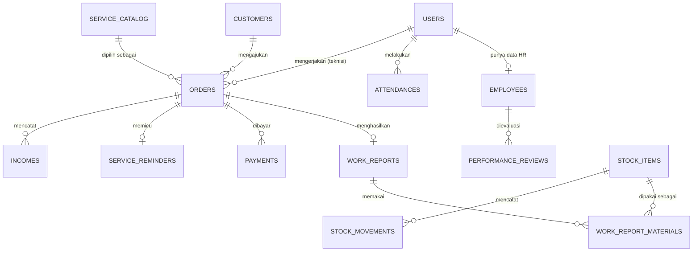

# Skema Database — One Gate System Paccing

Turunan teknis dari entitas di [`../PRD.md`](../PRD.md) §8. Ini rancangan awal (Fase 1 + catatan Fase 2), bukan migration final — nama kolom/tipe bisa menyesuaikan saat implementasi Laravel.

## Diagram Relasi (ringkas)

## Tabel Fase 1 (MVP)

### `users`
Akun login untuk semua role.

| Kolom | Tipe | Keterangan |
|---|---|---|
| id | bigint PK | |
| name | string | |
| email | string, unique | |
| phone | string | untuk kontak/WA |
| password | string (hashed) | |
| role | enum: owner, admin, finance, hr, teknisi | Fase 1: implementasi via `spatie/laravel-permission` supaya fleksibel multi-role per user |
| status | enum: aktif, nonaktif | |
| timestamps | | |

### `customers`
| Kolom | Tipe | Keterangan |
|---|---|---|
| id | bigint PK | |
| nama | string | |
| no_hp | string | |
| alamat | text | |
| area | enum: Makassar, Gowa, Maros | |
| sumber_lead | enum: instagram, whatsapp, telepon, referral, lainnya | |
| status | enum: lead, aktif, nonaktif | "aktif" = pelanggan berlangganan rutin |
| catatan | text, nullable | |
| timestamps | | |

### `service_catalog`
Master jenis layanan & harga — dipakai admin saat membuat order.

| Kolom | Tipe | Keterangan |
|---|---|---|
| id | bigint PK | |
| jenis_layanan | enum: cuci_ac, service_ac, pengadaan_ac | |
| jenis_unit | enum: split, standing, cassette, lainnya | nullable untuk pengadaan yang dijual per unit spesifik |
| pk | string, nullable | mis. "1 PK", "1.5 PK" |
| harga | decimal | |
| aktif | boolean | |
| timestamps | | |

### `orders`
Inti dari alur transaksi.

| Kolom | Tipe | Keterangan |
|---|---|---|
| id | bigint PK | |
| customer_id | FK → customers | |
| service_catalog_id | FK → service_catalog | |
| teknisi_id | FK → users, nullable | diisi saat assign |
| jumlah_unit | integer | |
| alamat_pengerjaan | text | default dari alamat customer, bisa diubah |
| tanggal_jadwal | date | |
| jam_jadwal | time, nullable | |
| status | enum: baru, terjadwal, menuju_lokasi, dikerjakan, selesai, butuh_followup, batal | `menuju_lokasi` diset teknisi lewat slider "mulai berangkat" sebelum check-in, lihat [konsep Teknisi](teknisi/01-konsep-teknisi.md) |
| catatan_admin | text, nullable | |
| created_by | FK → users | |
| timestamps | | |

> **Catatan Fase 2:** jika satu kunjungan bisa mencakup beberapa jenis layanan/unit sekaligus, pecah jadi `order_items` (order_id, service_catalog_id, jumlah, subtotal) dan `orders` jadi header saja. Lihat pertanyaan terbuka di `00-overview.md`.

### `work_reports`
Diisi teknisi setelah selesai kerja.

| Kolom | Tipe | Keterangan |
|---|---|---|
| id | bigint PK | |
| order_id | FK → orders | |
| teknisi_id | FK → users | |
| catatan_pengerjaan | text | |
| foto_sebelum | string (path), nullable | |
| foto_sesudah | string (path), nullable | |
| waktu_mulai | datetime | |
| waktu_selesai | datetime, nullable | |
| timestamps | | |

> Material terpakai **tidak lagi free-text** — dipilih dari `stock_items` lewat tabel relasi `work_report_materials`, supaya stok otomatis berkurang saat laporan disubmit.

### `work_report_materials`
Rincian material dari `stock_items` yang dipakai per laporan pengerjaan. Submit laporan → setiap baris di sini otomatis membuat satu `stock_movements` jenis `keluar`.

| Kolom | Tipe | Keterangan |
|---|---|---|
| id | bigint PK | |
| work_report_id | FK → work_reports | |
| stock_item_id | FK → stock_items | |
| jumlah | integer | |
| timestamps | | |

### `stock_items`
Master barang/perlengkapan AC (sparepart, consumable, unit AC untuk pengadaan).

| Kolom | Tipe | Keterangan |
|---|---|---|
| id | bigint PK | |
| nama_barang | string | mis. "Freon R32", "Kapasitor 25uF", "AC Split 1PK" |
| kategori | enum: sparepart, consumable, unit_ac | |
| satuan | string | mis. "pcs", "kg", "unit" |
| stok_saat_ini | integer | dihitung/disinkronkan dari total `stock_movements` |
| stok_minimum | integer, default 0 | untuk alert stok menipis |
| harga_beli | decimal, nullable | acuan saat catat pengeluaran pembelian stok |
| aktif | boolean | |
| timestamps | | |

### `stock_movements`
Kartu stok — setiap barang masuk (pembelian) atau keluar (dipakai teknisi/penyesuaian).

| Kolom | Tipe | Keterangan |
|---|---|---|
| id | bigint PK | |
| stock_item_id | FK → stock_items | |
| jenis | enum: masuk, keluar, penyesuaian | |
| jumlah | integer | |
| referensi | string, nullable | mis. "work_report:12" atau "pembelian manual" |
| keterangan | text, nullable | |
| dicatat_oleh | FK → users | |
| tanggal | date | |
| timestamps | | |

### `attendances`
Dipakai lintas modul: absensi teknisi di lokasi (dilihat dari modul Teknisi) sekaligus rekap kehadiran karyawan (dilihat dari modul HRD).

| Kolom | Tipe | Keterangan |
|---|---|---|
| id | bigint PK | |
| user_id | FK → users | |
| order_id | FK → orders, nullable | diisi jika absen terkait kunjungan ke customer |
| tanggal | date | |
| jam_masuk | datetime | |
| jam_keluar | datetime, nullable | |
| lokasi | string, nullable | alamat/koordinat saat check-in |
| status | enum: hadir, izin, sakit, alpha | |
| timestamps | | |

### `payments`
| Kolom | Tipe | Keterangan |
|---|---|---|
| id | bigint PK | |
| order_id | FK → orders | |
| metode | enum: cash, transfer, qris, ewallet | |
| status | enum: belum_bayar, dp, lunas | |
| total_tagihan | decimal | |
| jumlah_dibayar | decimal | |
| tanggal_bayar | date, nullable | |
| dicatat_oleh | FK → users | |
| timestamps | | |

### `service_reminders`
Dibuat otomatis saat order selesai & lunas.

| Kolom | Tipe | Keterangan |
|---|---|---|
| id | bigint PK | |
| customer_id | FK → customers | |
| order_id | FK → orders | order acuan |
| interval_bulan | integer | default sesuai jenis layanan (lihat pertanyaan terbuka PRD §10) |
| tanggal_servis_berikutnya | date | |
| status_notice | enum: belum_jatuh_tempo, siap_dihubungi, sudah_dihubungi, selesai | |
| timestamps | | |

### `incomes`
Tercatat otomatis dari `payments` berstatus lunas; kategori mengikuti `service_catalog.jenis_layanan` (cuci/service → jasa, pengadaan → material).

| Kolom | Tipe | Keterangan |
|---|---|---|
| id | bigint PK | |
| order_id | FK → orders, nullable | null jika income di luar order (jarang) |
| kategori | enum: jasa, material | |
| nominal | decimal | |
| tanggal | date | |
| keterangan | text, nullable | |
| timestamps | | |

### `expenses`
Input manual oleh Admin/Finance.

| Kolom | Tipe | Keterangan |
|---|---|---|
| id | bigint PK | |
| kategori | enum: material, perawatan, operasional | |
| nominal | decimal | |
| tanggal | date | |
| keterangan | text, nullable | |
| bukti | string (path), nullable | |
| dicatat_oleh | FK → users | |
| timestamps | | |

## Tabel Fase 2

### `employees`
Data HR untuk staff (teknisi & karyawan lain).

| Kolom | Tipe | Keterangan |
|---|---|---|
| id | bigint PK | |
| user_id | FK → users | |
| jabatan | string | |
| tanggal_masuk | date | |
| jenjang_karir | enum: junior, senior, lead | |
| status_karyawan | enum: aktif, nonaktif, resign | |
| timestamps | | |

### `performance_reviews`
| Kolom | Tipe | Keterangan |
|---|---|---|
| id | bigint PK | |
| employee_id | FK → employees | |
| periode | string, mis. "2026-09" | |
| skor | integer/decimal | |
| catatan | text | |
| dibuat_oleh | FK → users | |
| timestamps | | |

### `development_plans`
Rencana pengembangan usaha (Finance §PRD 4.4).

| Kolom | Tipe | Keterangan |
|---|---|---|
| id | bigint PK | |
| judul | string | |
| deskripsi | text | |
| target_anggaran | decimal, nullable | |
| target_tanggal | date, nullable | |
| status | enum: rencana, berjalan, selesai | |
| timestamps | | |

## Catatan Implementasi

- Semua tabel pakai `timestamps` (created_at, updated_at) standar Laravel + `softDeletes` untuk `customers`, `orders`, dan `payments` (data transaksi tidak boleh hilang permanen kalau terhapus tidak sengaja).
- `stock_items.stok_saat_ini` sebaiknya kolom cache (bukan dihitung live dari `SUM(stock_movements)` tiap request) yang di-update lewat event/observer tiap `stock_movements` baru dibuat — lebih murah untuk halaman list & alert stok menipis.
- Pembelian stok (jenis `masuk` di `stock_movements`) yang perlu tercatat sebagai pengeluaran → buat entri manual di `expenses` kategori `material` juga (belum otomatis di Fase 1, lihat pertanyaan terbuka di dev-plan Admin).
- Enum di atas adalah rancangan konsep — di migration Laravel bisa berupa kolom `string` + validasi, atau `enum` DB-level, tergantung preferensi maintenance.
- Foreign key `teknisi_id` di `orders` dan `user_id` di `attendances`/`employees` semuanya menunjuk ke tabel `users` yang sama (bukan tabel teknisi terpisah), karena teknisi = user dengan role `teknisi`.
